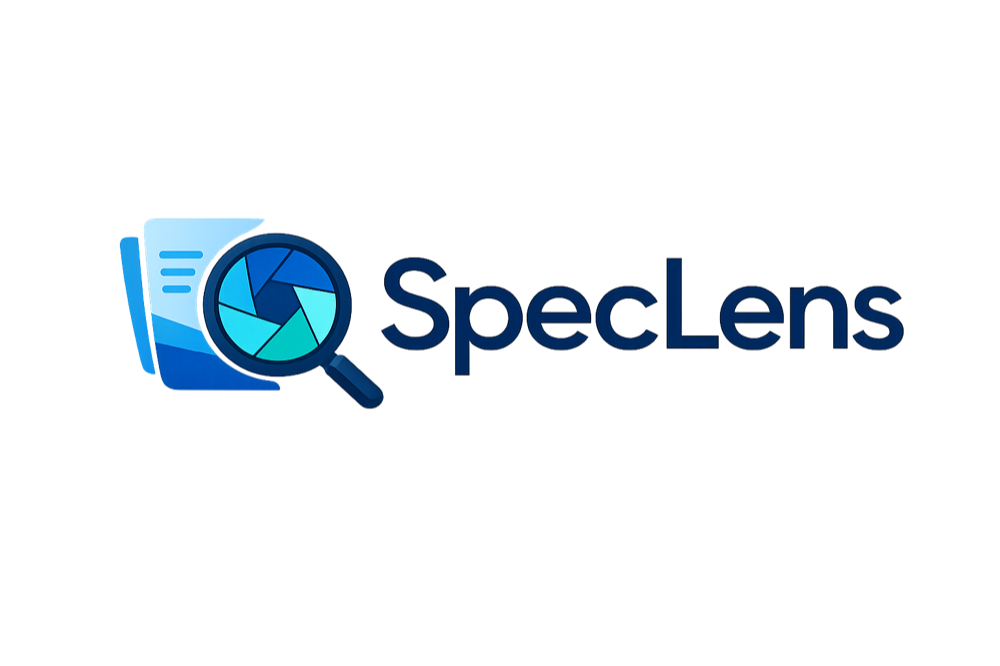
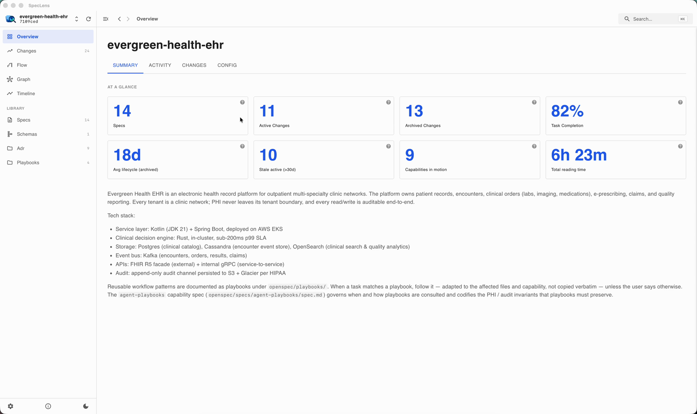
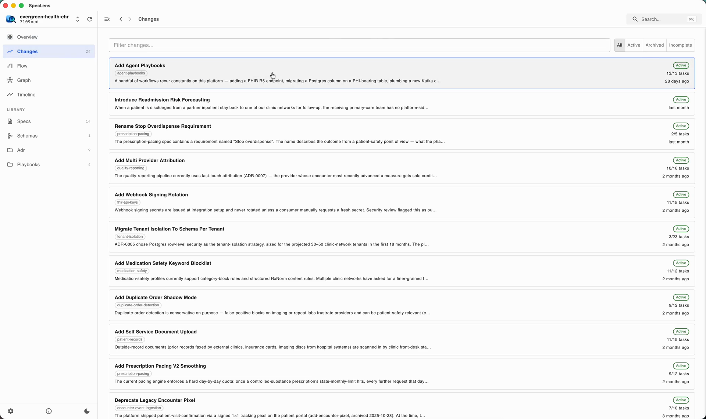
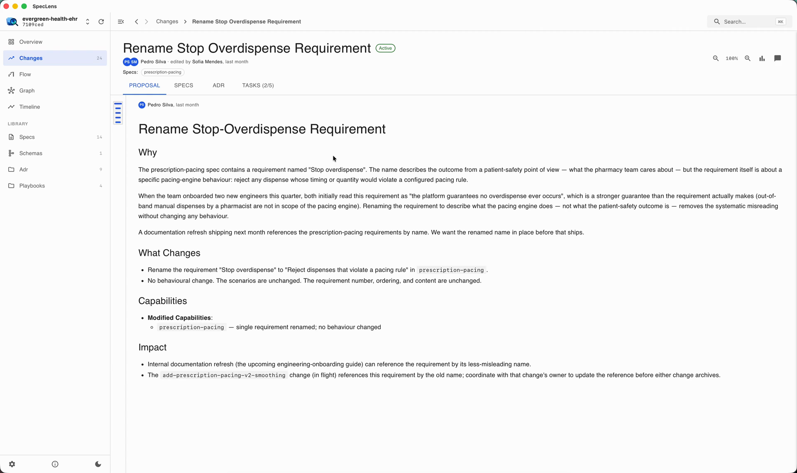
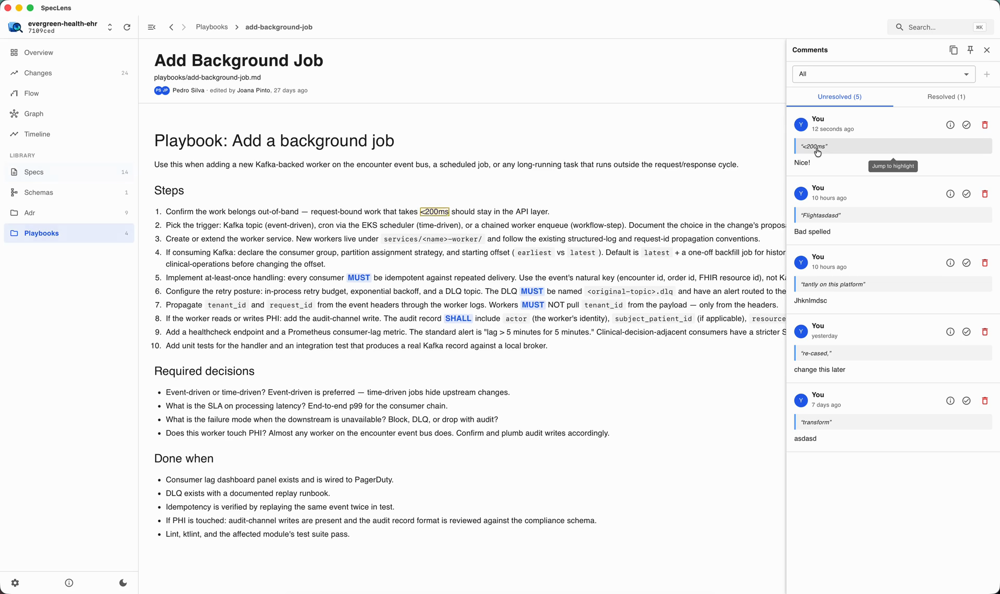
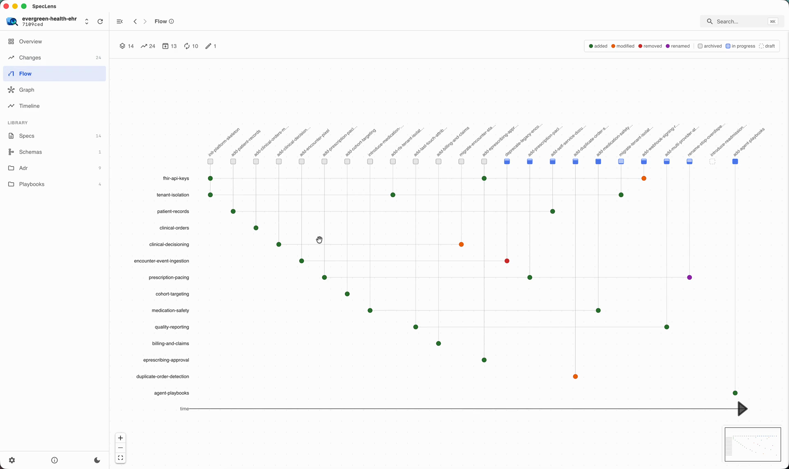
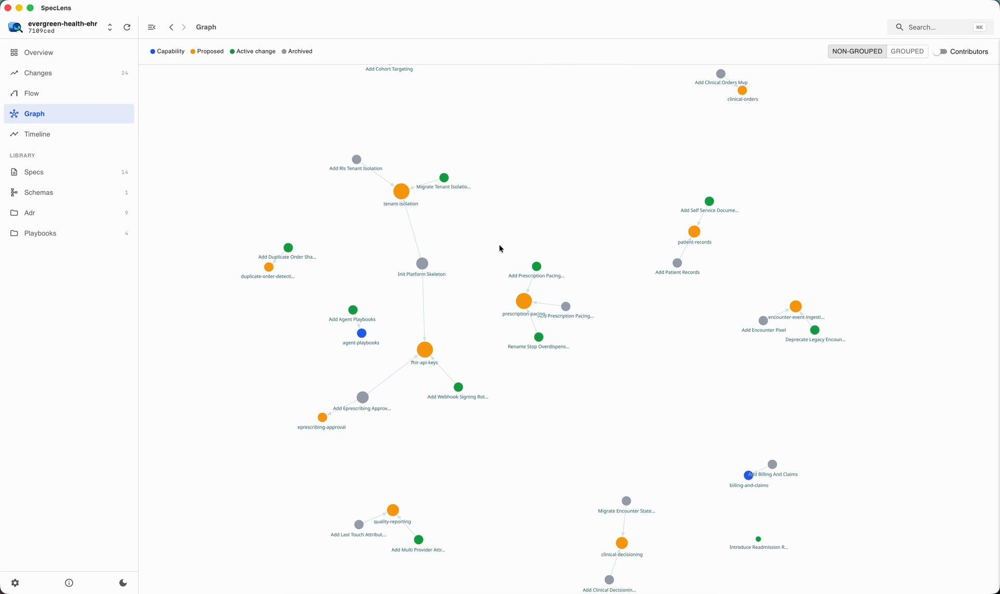
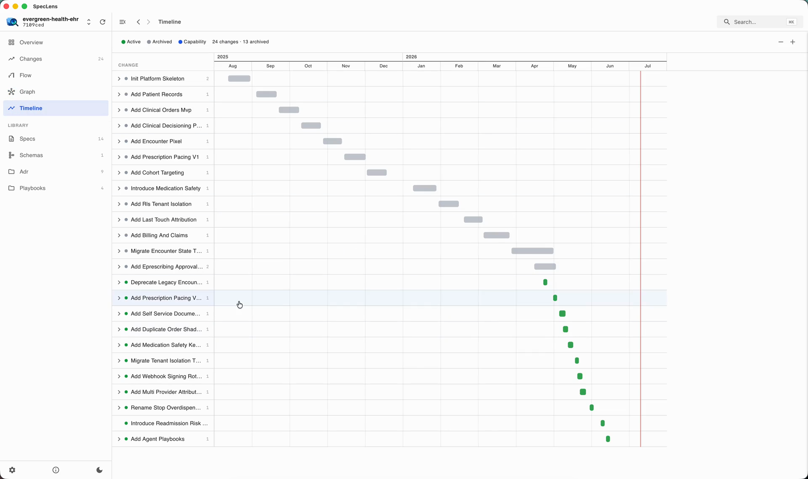
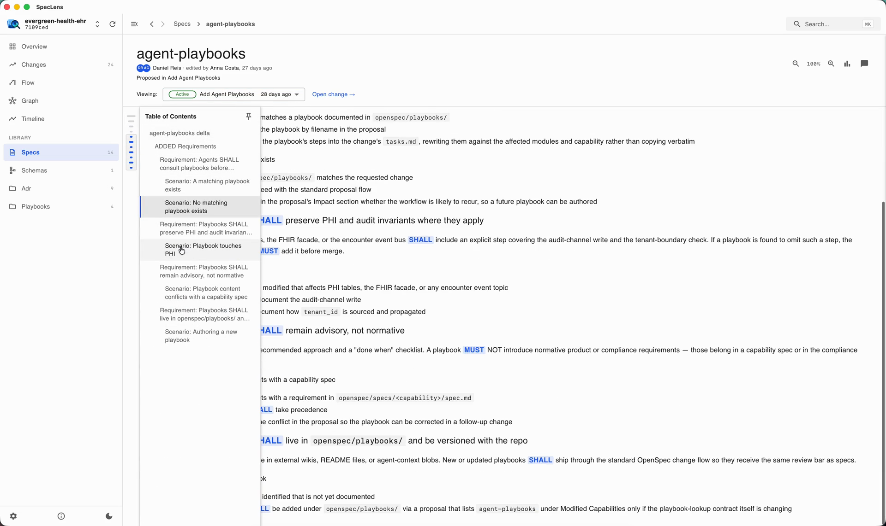

<div align="center">
  

  <p><strong>A desktop reader for <a href="https://github.com/Fission-AI/OpenSpec">OpenSpec</a> projects.</strong><br />
  Browse changes, trace how requirements evolved, and comment on specs - all from local folders.</p>
</div>

---

SpecLens reads the OpenSpec convention (`proposal.md` / `tasks.md` / `specs/<capability>/spec.md` under `openspec/changes/<change-slug>/`) straight from folders on your machine. Point it at any repository that uses OpenSpec and it gives you a reading experience the raw markdown can't:

- **Changes browser** - active and archived changes with tabs for proposal, tasks, design, and spec deltas, plus task-completion progress.
- **Timeline** - changes laid out chronologically, derived from git history.
- **Graph & Flow views** - how capabilities, changes, and specs relate to each other.
- **Specs & Schemas views** - the current state of every capability, and the schema that generated it.
- **Authorship** - when a project is a git repository, SpecLens runs `git log` per document to show who created and last edited each change. Without git it degrades gracefully.
- **Comments** - select any text to attach a comment; highlights persist locally (SQLite) and can be exported as markdown, ready to paste into an LLM conversation.
- **EARS keyword highlighting** - inline coloring for [EARS](https://alistairmavin.com/ears/) keywords, RFC 2119 modal verbs, and Gherkin steps (toggle in Settings).
- **Reader comforts** - minimap with table of contents, document stats and reading time, search palette, Mermaid diagram rendering, zoom, light/dark theme.

Everything is local. No accounts, no GitHub integration, no network calls - SpecLens only reads the folders you add.

## Demo

<!-- For an inline video player: edit this file on github.com and drag
     website/assets/demo-1920.mp4 into the editor - GitHub uploads it and
     inserts a user-attachments URL that renders as a player. Replace the
     linked poster below with that. -->

[](./website/assets/demo-1920.mp4)

<sub>Click through for the full 2-minute demo.</sub>

## A quick look

| | |
| --- | --- |
|  <br/><sub>**Overview** - specs, changes, and reading time at a glance</sub> |  <br/><sub>**Changes browser** - active and archived, with task progress</sub> |
|  <br/><sub>**Proposal reading** - tabs for proposal, specs, and tasks with git-derived attribution</sub> |  <br/><sub>**Comments** - select text to comment; export as markdown for an LLM</sub> |
|  <br/><sub>**Flow** - how changes touched each capability over time</sub> |  <br/><sub>**Graph** - capabilities, changes, and specs as a network</sub> |
|  <br/><sub>**Timeline** - every change laid out chronologically from git history</sub> |  <br/><sub>**Spec deltas** - EARS keywords highlighted, table of contents on the side</sub> |

## Install

**Homebrew** (macOS, Apple Silicon):

```sh
brew install --cask dansreis/tap/speclens
```

**Direct download**: grab the `.dmg` (or the Linux/Windows build) from [Releases](https://github.com/dansreis/speclens/releases) and drag SpecLens to `/Applications`. Builds are signed and notarized, so it opens without any Gatekeeper warnings.

Then click **Add repository** in the sidebar and pick any folder containing an `openspec/` directory.

No OpenSpec project at hand? Clone [openspec-examples](https://github.com/dansreis/openspec-examples) - two fictional products with a full year of spec-driven git history (proposals, specs, ADRs, tasks, playbooks) - and point SpecLens at either project folder. It's the same data the demo and screenshots above show.

## Development

Requires [pnpm](https://pnpm.io) and the [Tauri 2 prerequisites](https://tauri.app/start/prerequisites/) (Rust toolchain).

```sh
pnpm install
pnpm tauri dev   # native desktop window
pnpm dev         # browser only, at http://localhost:1420
```

| Command          | What it does               |
| ---------------- | -------------------------- |
| `pnpm build`     | `tsc && vite build`        |
| `pnpm typecheck` | `tsc --noEmit`             |
| `pnpm test`      | Vitest unit tests          |
| `pnpm check`     | Biome lint + format check  |
| `pnpm format`    | Biome auto-format          |

### Stack

Tauri 2 (Rust) · React 19 + TypeScript + Vite · MUI + Emotion · Zustand with SQLite write-through persistence · react-markdown.

### Layout

```
src/
├── App.tsx        # top-level layout: sidebar | header + content + comments
├── views/         # overview, changes, specs, schemas, folder, graph, flow, timeline
├── specs/         # change viewer, markdown rendering, minimap, stats
├── comments/      # comments panel + selection-to-comment
├── repos/         # repository switcher + add-repository flow
├── sidebar/       # navigation, settings, theme toggle
├── search/        # search palette
├── store/         # Zustand stores + SQLite bootstrap
└── lib/           # loaders, git-derived authorship, stats, highlighting
src-tauri/         # Rust shell: repo walking, git log, signatures
```

`CLAUDE.md` has deeper architectural notes; `docs/ROADMAP.md` tracks what's missing; `RELEASE.md` describes how releases are cut.

## License

[Apache 2.0](./LICENSE) - note that the license does not grant rights to the SpecLens name and logo.
