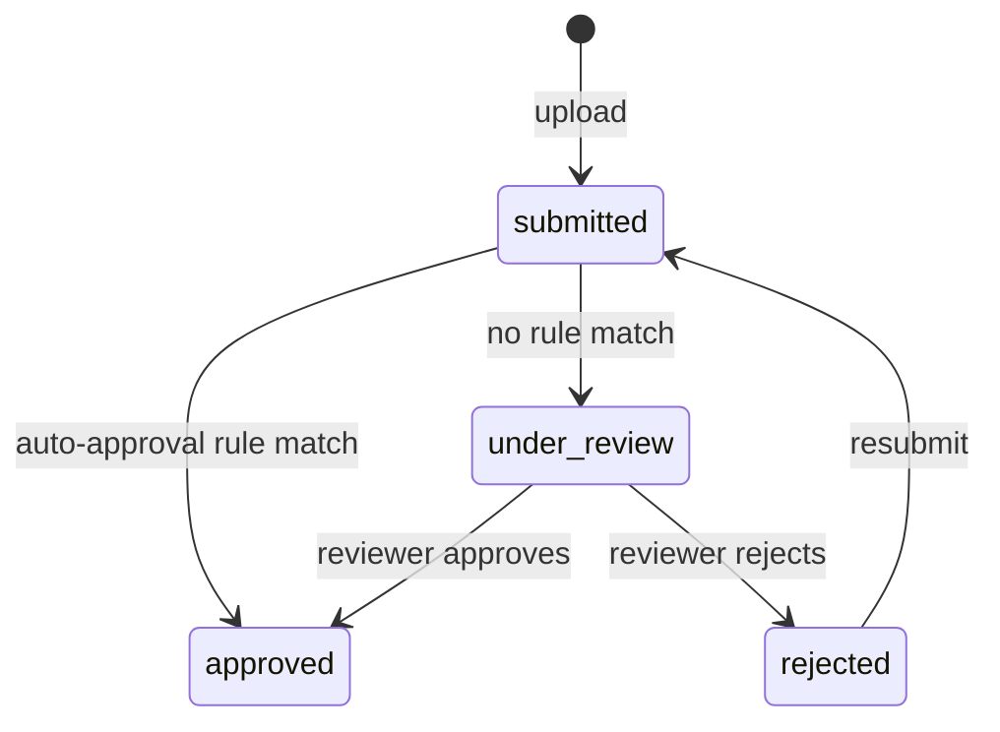

# Design — Add Self-Service Creative Upload

## Context

Creative uploads currently round-trip through an integration partner: brand uploads to the partner's tool, the partner POSTs a webhook to us, we pull the asset, retailers review in our retailer console. The flow works but costs (a) a per-creative fee to the partner, (b) up to a day of latency per upload, and (c) blocks three brands who have specifically asked for direct upload.

We also see a deeper problem: the existing creative-approval workflow gates every creative through human review, including categories where the owning retailer's review policy is effectively "rubber-stamp if formats are right". The self-service ask and the auto-approval gap can be addressed together.

## Goals / Non-Goals

**Goals:**
- Brands can upload creatives directly from our console — PNG / JPEG / HTML5 / MP4.
- Per-retailer auto-approval rules let retailers declare conditions under which review can be skipped.
- Self-service uploads land in the existing `creative_revisions` table — no new identity, no new audit channel.
- Existing manually-reviewed flow continues to work for retailers who don't configure auto-approval rules.

**Non-Goals:**
- This change does not remove the integration partner. Brands using the partner today continue to do so.
- This change does not address creative *generation* (AI-creative tools); only upload.
- This change does not change anything about how decisioning evaluates an approved creative. Auto-approved creatives serve identically to manually-approved ones.

## Decisions

### Decision: Auto-approval as a rule type on the creative-approval workflow, not a separate workflow

Two architectures were weighed:

1. **Rule-typed auto-approval inside the existing workflow** (chosen) — submission step branches on rule evaluation. Auto-approved creatives transition `submitted` → `approved` immediately; manually-reviewed creatives follow the existing `submitted` → `under_review` → `approved | rejected` path.
2. **Separate self-service workflow** — a parallel state machine for self-service uploads, distinct from the manually-reviewed path.

Single-workflow wins on every dimension: the resulting state-table is simpler, reporting consolidates, the audit channel is uniform. The cost is that the submission step does more work — that's a small price.

### Decision: Auto-approval rules are retailer-owned, not brand-owned

Brands cannot self-declare auto-approval. A retailer admin owns the rule set on their own surfaces. This preserves the retailer's gatekeeper role on what runs on their surfaces — the same property that makes the manually-reviewed flow trustworthy.

### Decision: MP4 upload limited to 30MB; HTML5 to 500KB

Format limits were set against representative retailer-surface render budgets. Larger sizes slow surface render and would force decisioning to make per-surface size decisions, complicating the bid response.

## State machine

```
                    upload
                       │
                       ▼
                ┌─────────────┐
                │  submitted  │
                └──────┬──────┘
                       │
              evaluate auto-approval rules
                       │
            ┌──────────┴──────────┐
   no rule match               rule match
            │                     │
            ▼                     ▼
    ┌──────────────┐        ┌──────────────┐
    │ under_review │        │   approved   │
    │ (human)      │        │ (auto)       │
    └──────┬───────┘        └──────────────┘
           │
    ┌──────┴──────┐
    ▼             ▼
┌────────┐  ┌──────────┐
│approved│  │ rejected │
└────────┘  └──────────┘
```

For reference (since mermaid is not rendered in this reader, the equivalent diagram in fenced source):



## Risks / Trade-offs

- **[Risk] Retailer mis-configures an auto-approval rule and lets through a creative they didn't intend to.** → Mitigation: every rule change audit-logged; retailer console shows a 7-day rolling list of auto-approved creatives with quick revoke; revoking pulls the creative from serving within 60s.
- **[Risk] Self-service upload becomes the dominant path; the integration partner fights us.** → Acceptable. The partner relationship has been net-cost-of-friction for a while.
- **[Risk] HTML5 zip-bomb upload.** → Mitigation: size limit + zip-validity scanner + sandboxed extraction in the upload service.

## Migration Plan

- No data migration required. Existing manually-reviewed flow is unchanged.
- Per-retailer auto-approval rules ship in retailer console; default rule set is empty (preserving existing behaviour) until a retailer configures rules.
- Three brand-direct-upload pilots gated behind a feature flag for the first month.

## Open Questions

- **HTML5 creative sandbox.** Browser-rendered creatives need a sandbox boundary at serve time. Existing partner-uploaded creatives go through the partner's sandboxing. We need our own. Owner: ad-decisioning team. Decide before brand-direct-upload feature flag flips to default-on.
